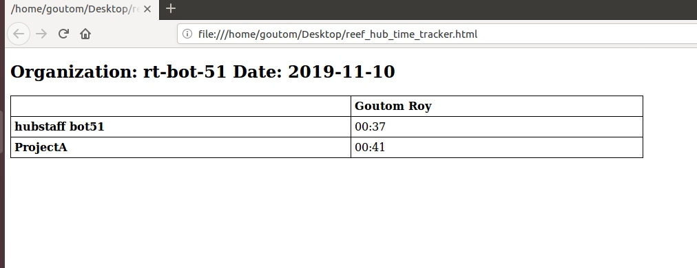

### Description  
[Hubstaff](https://hubstaff.com/) is a smart time tracking software for company to track employee's working hour.
It has a great api too, I am using [Api V1](https://app.hubstaff.com/developer/docs/api/v1). The ability to retrieve your data from Hubstaff will allow you to create your own custom 
solutions for displaying the data. For example, if you wanted to white-label the Hubstaff platform you could build a 
portal for your clients to log in and view activities, tasks, notes, and more.  

In this example you will be able to check working hours of your employees for particular date(by default yesterday) 
by using command line, it will open a html page to show data. It installs all required libraries it needs.  
It shows standard way of making requests using `aiohttp`, `requests` and `asyncio` to make multiple requests asynchronously.  

### Install Python 3.7.5, python3-pip

`sudo apt update`  
`sudo apt install software-properties-common`  
`sudo add-apt-repository ppa:deadsnakes/ppa`  
`sudo apt update`  
`sudo apt install python3.7`  
`sudo apt install python-pip`  
`sudo apt install python3-pip`  

### requirements.txt  
aiohttp==3.6.2  
Jinja2==2.10.3  
requests==2.22.0  
### Run
Run `start.py` file from `main` package with arguments from terminal or command line.  

**Command line example**  

`python3.7 main/start.py -app_token xxxxxxxxxxxxxxx  -date 2019-11-9 -email xxxxxx@gmail.com -password xxxx`  

##### Argument options  

Argument  | Required    | Description
---------|---------|----------------
-app_token | True |
-date | False  | By default yesterday. Input format : YYYY-mm-dd
-email  | True |
-password | True |
